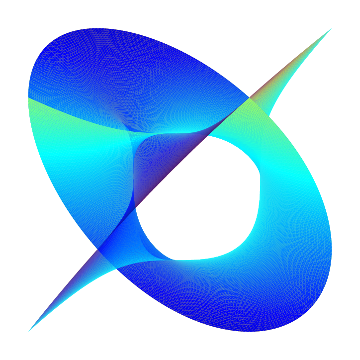
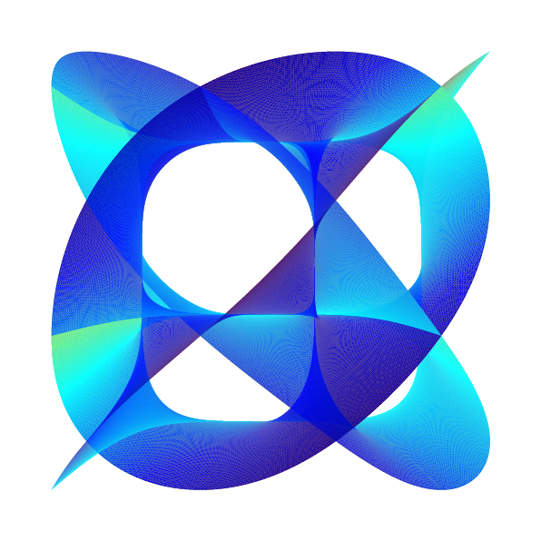

# CaleTZ

**CaleTZ** is a Typst package for visualizing **Calabi-Yau manifolds** using **CeTZ** 3D drawing primitives.  
It generates colorful, smooth 3D surfaces with adjustable parameters, making it easy to explore complex geometries directly in Typst.

<p align="center">
  
  
</p>

## Mathematical Description

CaleTZ visualizes a simplified projection of a **Calabi-Yau manifold**, defined implicitly by complex coordinates:

Let $n$ be the manifold degree. For each branch $(k_1, k_2)\in \{0,1,\dots,n-1\}^2$, define:

$$
\begin{align*}
U_1(a, b) &= \frac{1}{2}\Big(e^{a+ib} + e^{-a-ib}\Big)^{2/n},\\
U_3(a, b) &= \frac{1}{2}\Big(e^{a+ib} - e^{-a-ib}\Big)^{2/n},\\
z_1 &= e^{2\pi i k_1 / n} \cdot U_1(a, b),\\
z_2 &= e^{2\pi i k_2 / n} \cdot U_3(a, b),\\
(x, y, z) &= \Big(\mathrm{Re}(z_1), \mathrm{Re}(z_2), \cos(\alpha)\mathrm{Im}(z_1) + \sin(\alpha)\mathrm{Im}(z_2)\Big),
\end{align*}
$$

where:

- $a \in [0, \pi/2]$, $b \in [-\pi/2, \pi/2]$ are parametric angles.
- $\alpha$ is the rotation angle for the $z$-axis combination.
- $\mathrm{Re}, \mathrm{Im}$ denote the real and imaginary parts of a complex number.

The surface is rendered as a mesh over the $(a, b)$ domain, colored according to the $z$-coordinate.


## Installation

```bash
git clone https://github.com/rice8y/caletz.git
cd caletz
just install
```

This installs the package locally to Typst’s package directory.

## Usage Example

```typ
#import "@local/caletz:0.1.0": calabi-yau

#set page(width: auto, height: auto, margin: 1cm)
#calabi-yau(
  power: 3,
  angle: 0.4,
  subdivisions: 80
)
```

### Parameters

- `power`: Degree of the manifold (e.g., 3). Must be a positive integer.
- `angle`: Adjusts the combination of z-coordinates; smaller values flatten the surface.
- `subdivisions`: Controls mesh density; higher values give smoother surfaces.
- `colormap`: Optional, default `"jet"`. Can be `"viridis"`, `"plasma"`, `"cool"`, or `"hot"`.
- `scale-factor`: Optional, default `3.0`. Scales the entire mesh.
- `rotation`: Optional, default `(30deg, 45deg, 0deg)`. Rotates the 3D view.

> [!NOTE]
> For best results, use a high `subdivisions` value, but note it increases computation.

## License

This project is distributed under the MIT License. See [LICENSE](LICENSE).